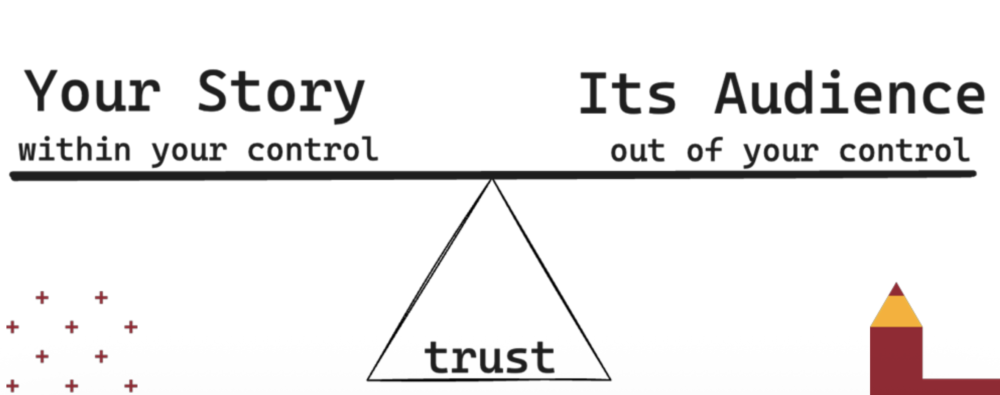
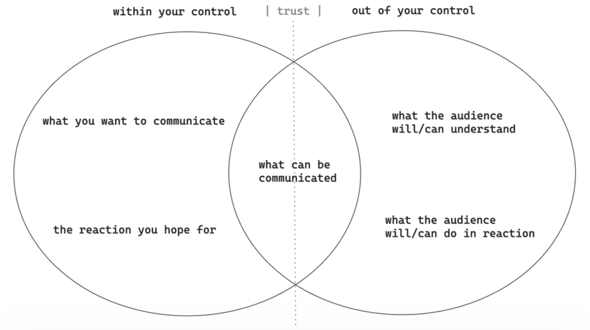
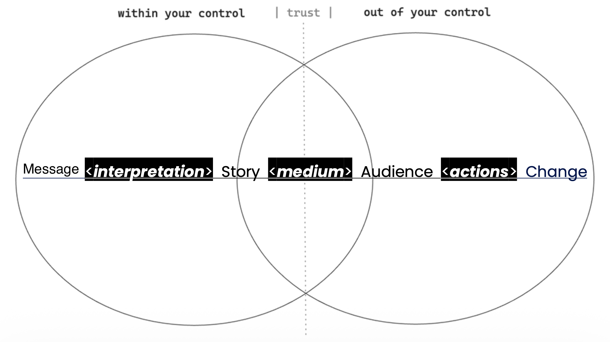
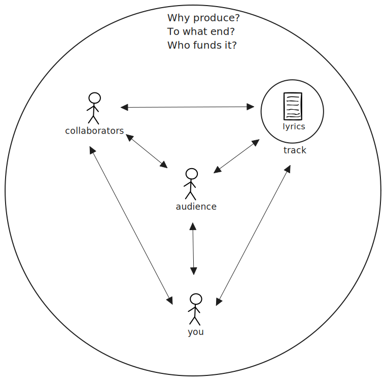

# Rhaptorix

A ~30 minute workshop asking students to think about and visualize the relationship between themselves, their audience, their track and their collaborators in different artistic contexts.

Agenda:

1. We introduce and discuss the vocabulary and visuals, use the first three diagrams in this doc to set the stage for the [rhetorical situation diagram](#the-rhetorical-situation).
2. Students split into groups of 3-4 to reconstruct and critique the rhetorical situation diagram
3. In their groups, students adjust the rhetorical situation diagram to better describe either GHOTIing, didactic rap or portraits (their choice).
4. Students connect the components of their updated diagram to the components in Lupe's formula for decoherence.
5. Each group shares their diagram and equation mapping.

---

## Communication is Balanced on Trust

## What can be Communicated?

## From Message to Change

## The Rhetorical Situation

